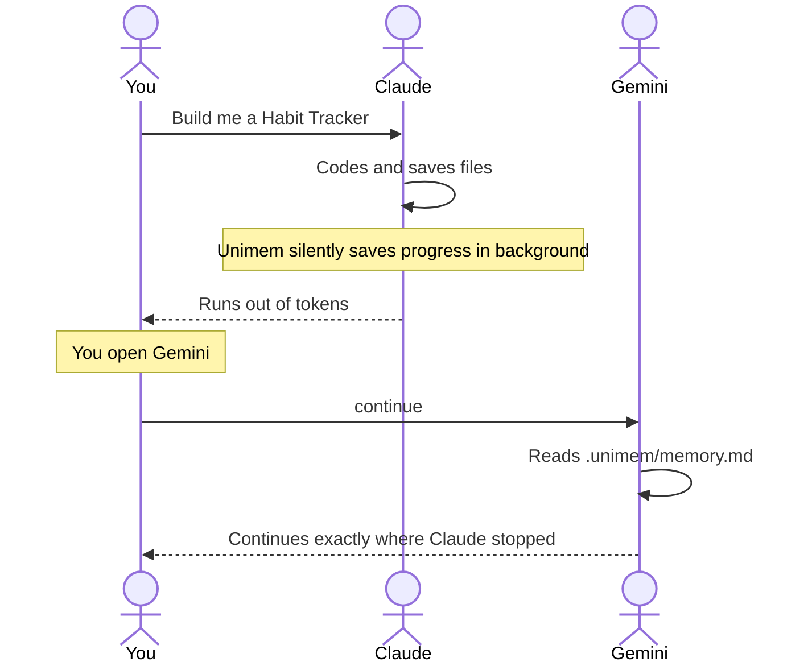

# Unimem — Universal Project Memory Layer for AI Coding Agents

[](https://opensource.org/licenses/MIT)
[](https://www.python.org/downloads/)
[](#-installation-guide)
[](https://github.com/korrakiran/homebrew-unimem)
[](https://github.com/korrakiran/collector)
[](https://github.com/korrakiran/collector/releases)

**Unimem** is a universal, persistent project memory and handoff layer designed for AI coding agents (like Claude Code, Gemini CLI, Cursor, Aider, Windsurf, Cline, GitHub Copilot, and Antigravity). It helps you seamlessly switch between different AI coding tools mid-project without losing context, progress, or architectural decisions.

---

## Why Unimem?

When building apps with AI agents, you often hit limits:
* **Token limits or context exhaustion** force you to restart your session.
* **Tool switching** (e.g., from Claude Code to Gemini CLI) means you have to write long prompt summaries to explain what you've done.
* **No persistent memory** means a fresh agent has no idea what code files exist, what features are finished, or why you chose a specific database pattern.

**Unimem solves this with a zero-command, persistent project brain.** The incoming agent automatically reads `.unimem/memory.md` to instantly learn the project state, while the outgoing agent writes its progress before exiting.

---

## Key Features

* **Zero-Command Handoff**: You don't need to manually initialize, watch, or compile. Global shell hooks copy rule files and auto-bootstrap Unimem on first `cd` into a repo under your home directory.
* **Double-Layer Memory & Bi-directional Sync**:
  * `AGENTS.md`: A repo-level startup file that tells compliant agents to read Unimem memory first, then update task/state before stopping.
  * `.unimem/state.json`: A structured, queryable schema of the roadmap, completed features, and file paths.
  * `.unimem/memory.md`: An auto-generated, human-readable project context file read by AI agents at startup. Edits made by the AI directly to `.unimem/memory.md` are automatically parsed and reconciled back into `state.json`.
* **Real-Time Updates**: `state.json` and `memory.md` are rebuilt on every file save event — not just on manual `unimem summary` runs. Context is never stale.
* **Crash & Interrupt Protection**: Signal handlers (`SIGTERM`/`SIGINT`) and orphan session recovery (sessions with no `end_time` older than 10 minutes) ensure context is saved even if an agent crashes mid-session.
* **Goal/Task Progression Loop**: Tracks `current_goal` → `current_task` → `next_task`. When a task is completed, run `unimem task done --next "..."` to promote the task chain forward.
* **Universal Agent Compatibility**: Writes rule files for multiple agents automatically — `.cursorrules` (Cursor), `.clauderules` (Claude Code), `.windsurfrules` (Windsurf), `.clinerules` (Cline), `.antigravityrules` (Antigravity), and `.github/copilot-instructions.md` (GitHub Copilot).
* **41 Tests, 100% Local**: No external API calls, no network requests, no cloud storage. 2,500+ lines of pure Python running entirely on your machine.

---

## Security & Privacy

Unimem is built with a local-first, privacy-respecting design:
* **Zero Network Calls**: The Unimem CLI runs 100% offline. It does not send any files, code snippets, or project data to any external server or cloud service.
* **Local Storage Only**: All project memory and configuration details are stored entirely locally inside the hidden `.unimem/` folder at the root of your project.
* **No External APIs**: The `local` summarizer engine uses built-in Python string parsing and regex heuristics to compile project state — your private code and logs are never sent to an external LLM provider.
* **Git Control**: You can choose whether to check the `.unimem/` folder into your GitHub repository (allowing teammates to share the same memory layer) or add it to `.gitignore` to keep it strictly local.

---

## Zero-Command Handoff in Action



---

## Installation Guide

### macOS Installation

#### Option 1: Via Homebrew (Recommended)
```bash
brew tap korrakiran/unimem
brew install korrakiran/unimem/unimem
source ~/.zshrc
```
*Note: Sourcing your shell configuration is only required once to activate the newly injected shell hooks in your current terminal session. Any newly opened terminal tabs or windows will load them automatically.*

#### Option 2: Via `pipx` (Isolated Python Env)
```bash
brew install pipx
pipx ensurepath
pipx install unimem
```

---

### Linux Installation

#### Option 1: Via Homebrew (Linuxbrew)
```bash
brew tap korrakiran/unimem
brew install korrakiran/unimem/unimem
source ~/.zshrc
```

#### Option 2: Via `pipx`
For Debian/Ubuntu systems:
```bash
sudo apt update
sudo apt install python3-pip python3-venv pipx
pipx ensurepath
pipx install unimem
```
*Note: Run `source ~/.bashrc` or restart your shell after installing pipx.*

---

### Windows Installation

#### Option 1: Via WSL (Windows Subsystem for Linux)
If you are developing inside WSL, follow the **Linux Installation** instructions above.

#### Option 2: Via `pipx` (Native Windows PowerShell / CMD)
Ensure you have Python 3.12+ installed, then open PowerShell and run:
```powershell
python -m pip install --user pipx
python -m pipx ensurepath
# Restart PowerShell, then run:
pipx install unimem
```

---

## CLI Command Reference

Unimem provides 8 CLI commands:

### `unimem init`
Initializes a new Unimem memory repository in the current directory.
* *Auto-run in the background by the shell hook when entering a new repo under your home directory.*

### `unimem status`
Displays the active project root, memory initialization status, and current task focus.
```text
╭────── Unimem Status ───────╮
│ test102                    │
│                            │
│ Root: /Users/kiran/test102 │
╰────────────────────────────╯
╭──────────────────── Current Focus ────────────────────╮
│ Goal: Initialize the repository and basic components  │
│ Current Task: Initialize the backend service          │
│ Next Task: Create a basic API endpoint                │
╰───────────────────────────────────────────────────────╯
```

### `unimem summary`
Compiles all recorded event logs (saves, git commits, terminal runs) and reconciles manual modifications inside `.unimem/state.json` to regenerate `.unimem/memory.md`.
* *Auto-run in the background by the shell hook after every command completes.*

### `AGENTS.md`
Repo-level startup instructions for compliant AI tools.
* Tells the next agent to read `.unimem/state.json` first and `.unimem/memory.md` second.
* Tells the next agent to update tasks and run `unimem summary` before stopping.

### `unimem task done`
Marks the current task as complete and promotes `next_task` → `current_task`.
```bash
unimem task done --next "build the frontend UI"
```

### `unimem continue`
Outputs a structured summary of the project state. This is what the incoming AI agent reads to instantly gain full project context.

### `unimem run -- <command>`
Runs a command inside the Unimem tracking sandbox. Intercepts the exit code, duration, and output and logs it as an event.
```bash
unimem run -- npm run build
unimem run -- pytest
```

### `unimem watch`
Starts a filesystem watcher that logs file changes (creations, edits, deletions) as Unimem events in real time.

### `unimem snapshot`
Creates, lists, or restores point-in-time backups of `state.json`.
```bash
unimem snapshot create
unimem snapshot list
unimem snapshot restore <snapshot_name>
```

---

## Memory Folder Structure

```text
AGENTS.md
.unimem/
├── state.json        # Structured JSON database of goals, tasks, and files
├── memory.md         # Auto-compiled markdown summary read by AI agents
├── events/           # Chronological event logs (file saves, git commits, run commands)
├── sessions/         # Session logs representing each AI agent interaction
├── snapshots/        # Point-in-time state backups
└── decisions/        # Markdown architecture decision logs (ADRs)
```

---

## Uninstallation Guide

### Remove Unimem CLI

#### If installed via Homebrew:
```bash
brew uninstall korrakiran/unimem/unimem
brew untap korrakiran/unimem
```

#### If installed via pipx:
```bash
pipx uninstall unimem
```

### Remove Shell Hooks from `~/.zshrc`
Open `~/.zshrc` in any editor and delete the block between these two lines (inclusive):
```text
# Unimem Auto-Rule Injector & Init
...
unimem_inject_rules
```
Then reload your shell:
```bash
source ~/.zshrc
```

### Remove Global Rule Files
```bash
rm -f ~/.cursorrules ~/.clauderules ~/.windsurfrules ~/.clinerules
```

### Remove Project Memory from a Specific Project
```bash
cd your-project
rm -rf .unimem AGENTS.md .cursorrules .clauderules .windsurfrules .clinerules .antigravityrules .github/copilot-instructions.md
```

### Remove All Project Memory Globally
To remove `.unimem/` from every project under your home directory:
```bash
find ~ -name ".unimem" -type d -maxdepth 4 -exec rm -rf {} + 2>/dev/null
```
*Use `maxdepth` carefully — adjust the value based on how deep your projects are nested.*

---

## Adapter Development Guide

Unimem ships with 4 built-in adapters (Claude, Gemini, Codex, Generic) and supports custom adapters via the registry pattern:

```python
from typing import Dict, Any, List
from unimem.adapters.base import BaseAdapter
from unimem.adapters.registry import AdapterRegistry

@AdapterRegistry.register("my_custom_agent")
class MyCustomAdapter(BaseAdapter):

    def load_context(self) -> Dict[str, Any]:
        return {
            "prompt_instructions": "resume development on task X"
        }

    def save_session(self, session_id: str, summary: str, files_changed: List[str]) -> None:
        pass

    def launch(self, command: List[str]) -> None:
        import subprocess
        subprocess.run(command)
```

---

## Contributing

We welcome contributions to Unimem! To set up local development:

1. Clone the repository:
   ```bash
   git clone https://github.com/korrakiran/unimem.git
   cd unimem
   ```
2. Set up virtual environment and install in editable mode with dev dependencies:
   ```bash
   python -m venv .venv
   source .venv/bin/activate
   pip install -e ".[dev]"
   ```
3. Run the 41-test suite:
   ```bash
   pytest
   ```

---

## License

This project is licensed under the MIT License - see the [LICENSE](LICENSE) file for details.
