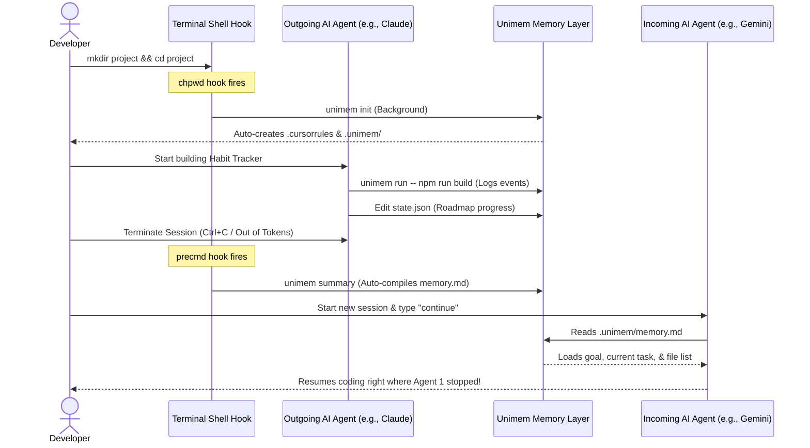

# 🧠 Unimem — Universal Project Memory Layer for AI Coding Agents

[](https://opensource.org/licenses/MIT)
[](https://www.python.org/downloads/)
[](#-installation-guide)
[](https://github.com/korrakiran/homebrew-unimem)

**Unimem** is a universal, persistent project memory and handoff layer designed for AI coding agents (like Claude Code, Gemini CLI, Cursor, Aider, Windsurf, and more). It helps you seamlessly switch between different AI coding tools mid-project without losing context, progress, or architectural decisions.

---

## 💡 Why Unimem?

When building apps with AI agents, you often hit limits:
* ⚠️ **Token limits or context exhaustion** force you to restart your session.
* ⚠️ **Tool switching** (e.g., from Claude Code to Gemini CLI) means you have to write long prompt summaries to explain what you've done.
* ⚠️ **No persistent memory** means a fresh agent has no idea what code files exist, what features are finished, or why you chose a specific database pattern.

**Unimem solves this with a zero-command, persistent project brain.** The incoming agent automatically reads `.unimem/memory.md` to instantly learn the project state, while the outgoing agent writes its progress before exiting.

---

## ✨ Key Features

* 🚀 **Zero-Command Handoff**: You don't need to manually initialize, watch, or compile. Global shell hooks copy rule files and initialize memory automatically.
* 📝 **Double-Layer Memory**:
  * `.unimem/state.json`: A structured, queryable schema of the roadmap, completed features, and file paths.
  * `.unimem/memory.md`: An auto-generated, human-readable project context file read by AI agents at startup.
* 🛡️ **Abrupt Crash Protection**: The Zsh shell hook automatically triggers `unimem summary` in the background every time a command completes. If an agent crashes or is interrupted (`Ctrl+C`), your project memory is saved instantly.
* 🔌 **Universal Agent Compatibility**: Works with any agent that respects `.cursorrules` or `.clauderules`.

---

## 🔄 Zero-Command Handoff in Action



---

## 🚀 Installation Guide

### 🍏 macOS Installation

#### Option 1: Via Homebrew (Recommended)
You can tap and install Unimem globally with a single command:
```bash
brew tap korrakiran/unimem
brew install korrakiran/unimem/unimem
source ~/.zshrc
```
*Note: Sourcing your shell configuration is only required once to activate the newly injected shell hooks in your current terminal session. Any newly opened terminal tabs or windows will load them automatically.*

#### Option 2: Via `pipx` (Isolated Python Env)
```bash
brew install pipx
pipx ensurepath
pipx install unimem
```

---

### 🐧 Linux Installation

#### Option 1: Via Homebrew (Linuxbrew)
```bash
brew tap korrakiran/unimem
brew install korrakiran/unimem/unimem
source ~/.zshrc
```

#### Option 2: Via `pipx`
For Debian/Ubuntu systems:
```bash
sudo apt update
sudo apt install python3-pip python3-venv pipx
pipx ensurepath
pipx install unimem
```
*Note: Run `source ~/.bashrc` or restart your shell after installing pipx.*

---

### 💻 Windows Installation

#### Option 1: Via WSL (Windows Subsystem for Linux)
If you are developing inside WSL, follow the **Linux Installation** instructions above.

#### Option 2: Via `pipx` (Native Windows PowerShell / CMD)
Ensure you have Python 3.12+ installed, then open PowerShell and run:
```powershell
python -m pip install --user pipx
python -m pipx ensurepath
# Restart PowerShell, then run:
pipx install unimem
```

---

## 🛠️ CLI Command Reference

Unimem provides a set of powerful, lightweight CLI commands:

### `unimem init`
Initializes a new Unimem memory repository in the current directory. 
* *Auto-run in the background by the shell hook when entering a new folder.*

### `unimem status`
Displays the active project root, memory initialization status, and current task focus.
```text
╭────── Unimem Status ───────╮
│ test102                    │
│                            │
│ Root: /Users/kiran/test102 │
╰────────────────────────────╯
╭──────────────────── 🎯 Current Focus ────────────────────╮
│ Goal: Initialize the repository and basic components     │
│ Current Task: Initialize the backend service             │
│ Next Task: Create a basic API endpoint                   │
╰──────────────────────────────────────────────────────────╯
```

### `unimem summary`
Compiles all recorded event logs (saves, git commits, terminal runs) and reconciles manual modifications inside `.unimem/state.json` to regenerate the markdown `.unimem/memory.md` file.
* *Auto-run in the background by the shell hook after every command completes.*

### `unimem continue`
Outputs a structured summary of the project state. This is what the incoming AI agent reads to instantly gain full project context.

### `unimem run -- <command>`
Runs a command inside the Unimem tracking sandbox (e.g. `unimem run -- npm run build`). This intercepts the command's exit code, duration, and output and logs it as an event to help compile the project history.

### `unimem watch`
Starts a filesystem watcher that logs file changes (creations, edits, deletions) as Unimem events in real time.

---

## 📂 Memory Folder Structure

All project memory resides inside a local, hidden `.unimem/` folder at the root of your project:

```text
.unimem/
├── state.json        # Structured JSON database of goals, tasks, and files
├── memory.md         # Auto-compiled markdown summary read by AI agents
├── events/           # Chronological event logs (file saves, git commits, run commands)
├── sessions/         # Session logs representing each AI agent interaction
├── snapshots/        # Point-in-time state backups
└── decisions/        # Markdown architecture decision logs (ADRs)
```

---

## 🔌 Adapter Development Guide

Unimem uses an Adapter pattern to connect code intelligence with agents. Custom adapters can be registered to support proprietary agents:

```python
from typing import Dict, Any, List
from unimem.adapters.base import BaseAdapter
from unimem.adapters.registry import AdapterRegistry

@AdapterRegistry.register("my_custom_agent")
class MyCustomAdapter(BaseAdapter):
    
    def load_context(self) -> Dict[str, Any]:
        return {
            "prompt_instructions": "resume development on task X"
        }

    def save_session(self, session_id: str, summary: str, files_changed: List[str]) -> None:
        pass

    def launch(self, command: List[str]) -> None:
        import subprocess
        subprocess.run(command)
```

---

## 🤝 Contributing

We welcome contributions to Unimem! To set up local development:

1. Clone the repository:
   ```bash
   git clone https://github.com/korrakiran/collector.git
   cd collector
   ```
2. Set up virtual environment and install in editable mode with dev dependencies:
   ```bash
   python -m venv .venv
   source .venv/bin/activate
   pip install -e ".[dev]"
   ```
3. Run tests using pytest:
   ```bash
   pytest
   ```

---

## 📄 License

This project is licensed under the MIT License - see the [LICENSE](LICENSE) file for details.
