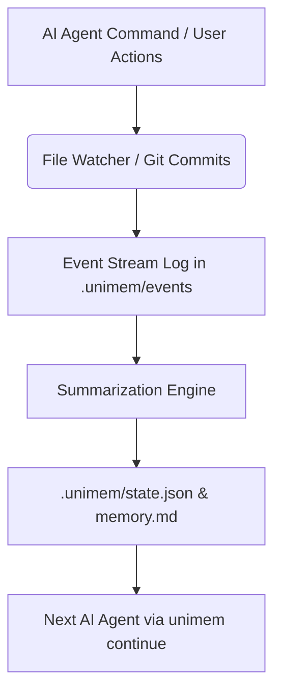

# Unimem — Universal Project Memory Layer for AI Coding Agents

If one AI agent runs out of tokens or context window limits, you can switch to another agent, say `continue`, and the new agent immediately understands the exact context of the project.

### ⚡ Zero-Command Handoff Automation (How it Works)

**You don't need to initialize, watch, or compile manually anymore—the global rules force the agents to manage the Unimem memory state themselves!**

Here is the exact sequence of what happens under the hood:
1. **You open Antigravity (or any other agent) and say "build project X":**
   - The agent starts up, reads the global `~/.cursorrules` file, notices the folder has no project memory yet, and silently runs `unimem init` in the background.
   - As it creates code files, it silently saves the state and updates `.unimem/memory.md` with goals and file details.
2. **The first agent runs out of tokens and you terminate the session.**
3. **You open Gemini CLI, Codex, or Claude Code in that directory:**
   - The new agent starts up, reads the global `~/.cursorrules` / `~/.clauderules`, and immediately executes a command to read `.unimem/memory.md` to load the current workspace context.
4. **You type `continue`:**
   - Because the agent has already read `.unimem/memory.md` and knows the exact project state, it will immediately understand what files were created, what features are finished, and pick up right where the first agent stopped!

---

## 🚀 Installation Guide

Unimem is cross-platform and supports **macOS**, **Linux**, and **Windows**.

### 🍏 macOS Installation

#### Option 1: Via Homebrew (Recommended)
You can tap and install Unimem globally:
```bash
brew tap korrakiran/unimem
brew install unimem
```

#### Option 2: Via `pipx` (Isolated Python Env)
`pipx` automatically manages virtual environments for Python command-line tools:
```bash
brew install pipx
pipx ensurepath
pipx install unimem
```

---

### 🐧 Linux Installation

#### Option 1: Via Homebrew (Linuxbrew)
If you run Homebrew on Linux, you can install Unimem exactly like macOS:
```bash
brew tap korrakiran/unimem
brew install unimem
```

#### Option 2: Via `pipx`
For Debian/Ubuntu systems:
```bash
sudo apt update
sudo apt install python3-pip python3-venv pipx
pipx ensurepath
pipx install unimem
```
*Note: Run `source ~/.bashrc` or restart your shell after installing pipx.*

---

###  Windows Installation

#### Option 1: Via WSL (Windows Subsystem for Linux)
If you are developing inside WSL, follow the **Linux Installation** instructions above.

#### Option 2: Via `pipx` (Native Windows Powershell / CMD)
Ensure you have Python 3.12+ installed, then open PowerShell and run:
```powershell
python -m pip install --user pipx
python -m pipx ensurepath
# Restart PowerShell, then run:
pipx install unimem
```

#### Option 3: Direct Pip
```powershell
pip install unimem
```

---

## 🏛️ Architecture

Unimem stores all project memory in a local `.unimem/` folder at the project root.

```text
.unimem/
├── state.json        # Compiled JSON database of project intelligence
├── memory.md         # Auto-generated markdown of the current state
├── events/           # Chronological logs of every event (file saves, git commits, runs)
├── sessions/         # AI sessions showing active/ended agent logs
├── snapshots/        # Backups of prior ProjectStates
└── decisions/        # Markdown architecture decisions logs
```

### Flow Diagram



---

## 🛠️ CLI Commands

### 1. Initialize Project Memory
Initialize Unimem in the current working directory. This also automatically creates `.cursorrules` and `.clauderules` to instruct new agents to load Unimem on startup.
```bash
unimem init --name "MyProject" --desc "A great python web app"
```

### 2. Check Memory Status
Display the active branch, recent events table, current task focus, and changes.
```bash
unimem status
```

### 3. Generate Handoff Resume
Print handoff instructions optimized for AI context consumption.
```bash
unimem continue
```
*Tip: Use `--raw` (or `-r`) to output raw markdown for piping to other tools.*

### 4. Rebuild State summary
Trigger the heuristic compiler to summarize all logged events since the last session.
```bash
unimem summary
```

### 5. Diagnostics Check
Verify Unimem environment folders and health.
```bash
unimem doctor
```

### 6. Run Agent Sandbox
Execute an agent tool wrapper ensuring Unimem variables and sessions are tracked automatically.
```bash
unimem run -a claude -- claude
```

### 7. Filesystem Watcher
Run a background observer to track file creations, moves, deletions, and updates.
```bash
unimem watch
```

---

## 🔌 Adapter Development Guide

Unimem uses an Adapter pattern to connect code intelligence with agents. Custom adapters can be registered without modifying core code.

### Writing a Custom Adapter
Create a python file in the `unimem/adapters/` directory or register from an external plugin:

```python
from pathlib import Path
from typing import Dict, Any, List
from unimem.adapters.base import BaseAdapter
from unimem.adapters.registry import AdapterRegistry

@AdapterRegistry.register("my_custom_agent")
class MyCustomAdapter(BaseAdapter):
    
    def load_context(self) -> Dict[str, Any]:
        return {
            "prompt_instructions": "resume development on task X"
        }

    def save_session(self, session_id: str, summary: str, files_changed: List[str]) -> None:
        pass

    def launch(self, command: List[str]) -> None:
        import subprocess
        subprocess.run(command)
```

---

## 🤝 Contribution Guide

We welcome contributions to Unimem! To set up local development:

1. Clone the repository:
   ```bash
   git clone https://github.com/korrakiran/collector.git
   cd collector
   ```
2. Set up virtual environment and install in editable mode with dev dependencies:
   ```bash
   python -m venv .venv
   source .venv/bin/activate
   pip install -e ".[dev]"
   ```
3. Run tests using pytest:
   ```bash
   pytest
   ```
4. Follow PEP 8 guidelines and write tests for any new adapters or commands.

---

## 📄 License
This project is licensed under the MIT License - see the [LICENSE](file:///Users/kiran/collector/LICENSE) file for details.
